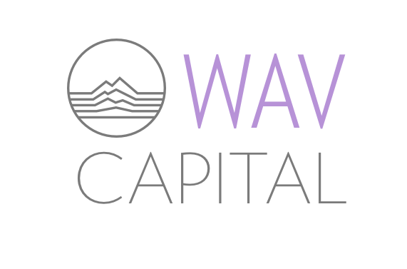

# WavCapital-logo
Client Product - Logo for Wav Capital

## The Goal 

Create a logo for Wav Capital, a student run VC, that is clean and channel's Alberta. 

## The Approach 

The client showed me the Font Awesome wrench icon, which they were currently using as a stand-in logo, and some images of logos for me to use as inspiration - specifically commenting that they were based on fundamental geometric shapes. 

I set out to build a logo that was simple like the geometric examples and also referred to tools in some way like the wrench. 

## The Process

I went over a bunch of different ideas with the client over the phone. Talking about what Wav is and how it feels. I really fell in love with the idea of a sonic waveform and tried to work that into the design. 

After some inspiration from the internet I came up with the (imo iconic) symbol of the sonic mountain range and featured it with a serine hue of purple. 

For the logo I worked around with the icon and how I could place the company name around it. I ended up with a striking and sharp font, Verlag, to keep the cleanliness and accent the mountain range.

=======

This would be the final designs that the client was sent. All the final designs are here in this Github repository, as well as some different icon colourings (check it out!). 

## Roles 

Created as a Freelance Designer 
